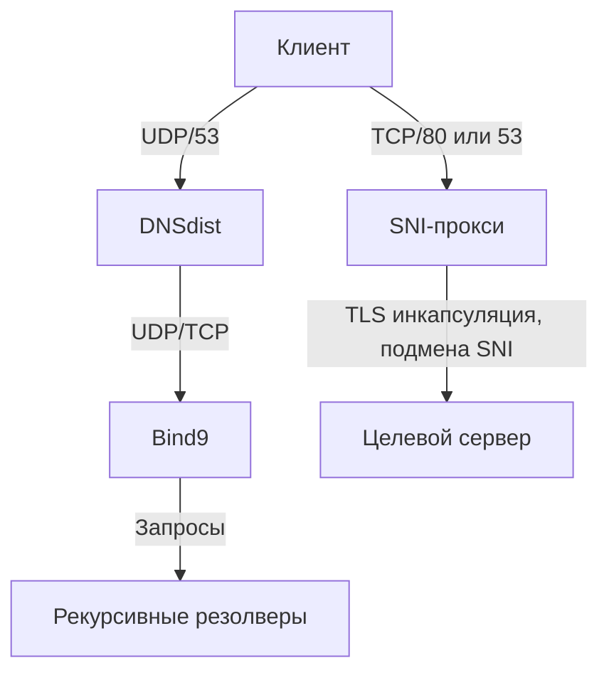

# AstraDNS Core

  

**Высокопроизводительная DNS-инфраструктура с обходом блокировок через SNI-прокси.**

---

## Техническая архитектура

### DNS-резолвинг
- Рекурсивный/авторитативный сервис
- Цепочка обработки: Клиент → DNSdist → Bind9
- Фильтрация трафика в DNSdist
- Anycast-ready архитектура

### SNI-проксирование
- Динамическая маршрутизация TCP-трафика
- Подмена SNI на `astracat.ru`
- Поддержка протоколов:
  - DNS-over-TCP (порт 53)
  - HTTPS (порт 80)
  - Любой TCP-трафик

---

## Активные ноды

| Компонент       | IP-адрес        | Порт    | Протокол | Назначение                  |
|-----------------|-----------------|---------|----------|-----------------------------|
| **DNS Core**    | 87.121.221.179  | 53      | UDP/TCP  | Основное разрешение запросов |
| **SNI Gateway** | 176.125.254.77  | 80, 53  | TCP      | Проксирование трафика       |

> ⚠️ **IP-адреса могут изменяться!** Актуальная информация в [Telegram-канале](https://t.me/astracatui)

---

## Сетевая схема

---

---

В этом репозитории только конфиги.

---

## Ресурсы

- Официальный сайт: [astracat.ru](https://astracat.ru)
- Telegram-канал: [@astracatui](https://t.me/astracatui)

